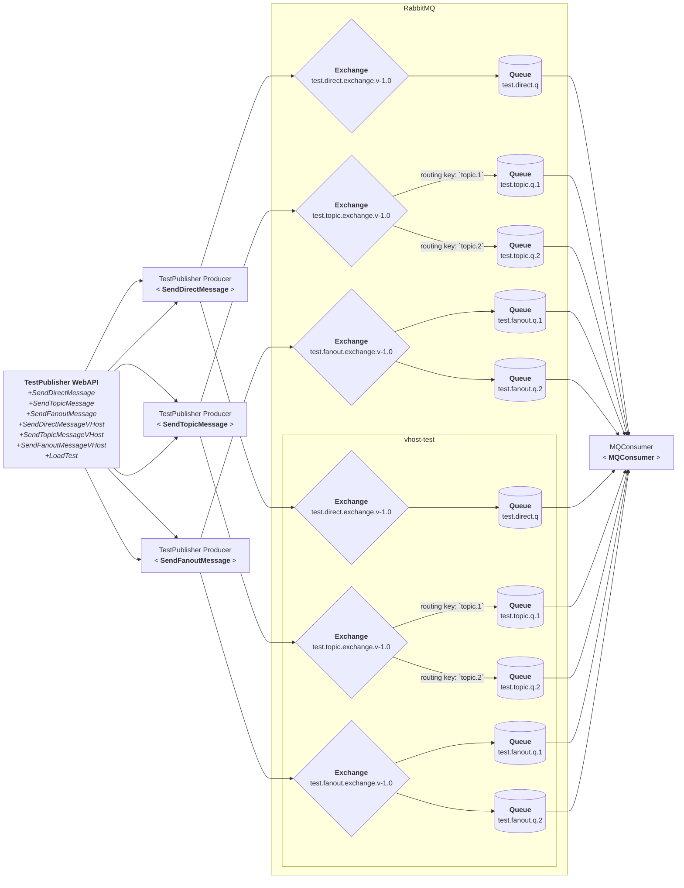

# Build RabbitMQ solution
Run the setup-amq.bat in windows to create the RabbitMQ solution.  
Alternatively, you can create and run a setup-amq.sh in linux to create the RabbitMQ solution.  
You can also create the solution manually through the RabbitMQ management console.  

Use the teardown-amq.bat to remove the RabbitMQ solution.  

The solution architecture is shown below.

## Architecture

